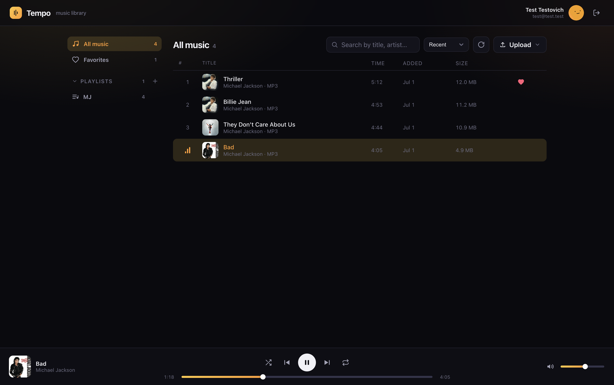
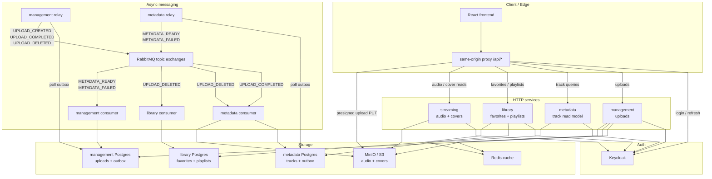

# Tempo

A self-hosted online music player, built as a pet project for practicing event-driven microservices in Python.

Upload an audio file and Tempo extracts its tags and cover art, adds it to a shared track library, and streams it back — with playlists and favorites on top.



## Architecture



Five independent uv projects (Python 3.14) plus a React SPA:

| Component | Port | Purpose |
|---|---|---|
| `management` | 8001 | Upload API: presigned S3 uploads and the upload lifecycle |
| `streaming` | 8002 | Audio & cover streaming from S3 with HTTP Range support |
| `metadata` | 8003 | Track-library read model; extracts tags from uploads (tinytag) |
| `library` | 8004 | Playlists & favorites |
| `toolkit` | — | Shared library: messaging contracts, S3/Keycloak clients, JWT utils |
| `frontend` | 5173 | React 19 + TypeScript + Vite SPA |
| `starter` | — | docker-compose for local infra |

Every backend service is hexagonal (ports & adapters) with [dishka](https://github.com/reagento/dishka) DI. Services never call each other directly — they communicate through RabbitMQ using the transactional outbox pattern: domain changes and an outbox row are written in one DB transaction, a relay process publishes the events, and consumers react to them.

**Upload flow:** the client gets a presigned URL from `management` and PUTs the file straight to S3 → `UPLOAD_COMPLETED` event → `metadata` extracts tags and any embedded cover → `METADATA_READY` / `METADATA_FAILED` → `management` marks the upload completed or failed. Deleting an upload runs a saga the other way, cascading through metadata, favorites, and playlists.

**Auth** is Keycloak with audience-scoped JWTs: the SPA holds a broad session token for API calls and mints a separate narrow token just for the `<audio>` streaming cookie.

## Stack

- **Backend:** FastAPI, dishka, SQLAlchemy 2 (asyncpg), Alembic, FastStream (RabbitMQ), pydantic
- **Infra:** PostgreSQL, RabbitMQ (quorum queues + DLQ), MinIO (S3), Keycloak, Redis
- **Frontend:** React 19, TypeScript, Vite

## Running locally

```bash
# Infra: MinIO, Postgres, Keycloak, RabbitMQ, Redis, local PyPI
docker network create local.network
cd starter && cp .env.example .env && docker compose up -d
# NB: add the metadata and library DBs to POSTGRES_MULTIPLE_DATABASES in starter/.env
# before first start — the example file lists only management and keycloak

# Each backend service (management, metadata, streaming, library):
cd <service> && uv sync --group local
cd <service>/src && ../.venv/bin/alembic -c ../alembic.ini upgrade head  # skip for streaming (no DB)
cd <service>/src && ../.venv/bin/python -m app.main.start

# management & metadata also run a relay (outbox → RabbitMQ) and a consumer;
# library runs only a consumer
cd <service>/src && ../.venv/bin/python -m app.main.relay
cd <service>/src && ../.venv/bin/python -m app.main.consumer

# Frontend (proxies all services through the Vite dev server)
cd frontend && npm install && npm run dev  # http://localhost:5173
```

Or run everything in Docker: `cd starter/scripts && make up` (the `toolkit` wheel must be published to the local PyPI first).
